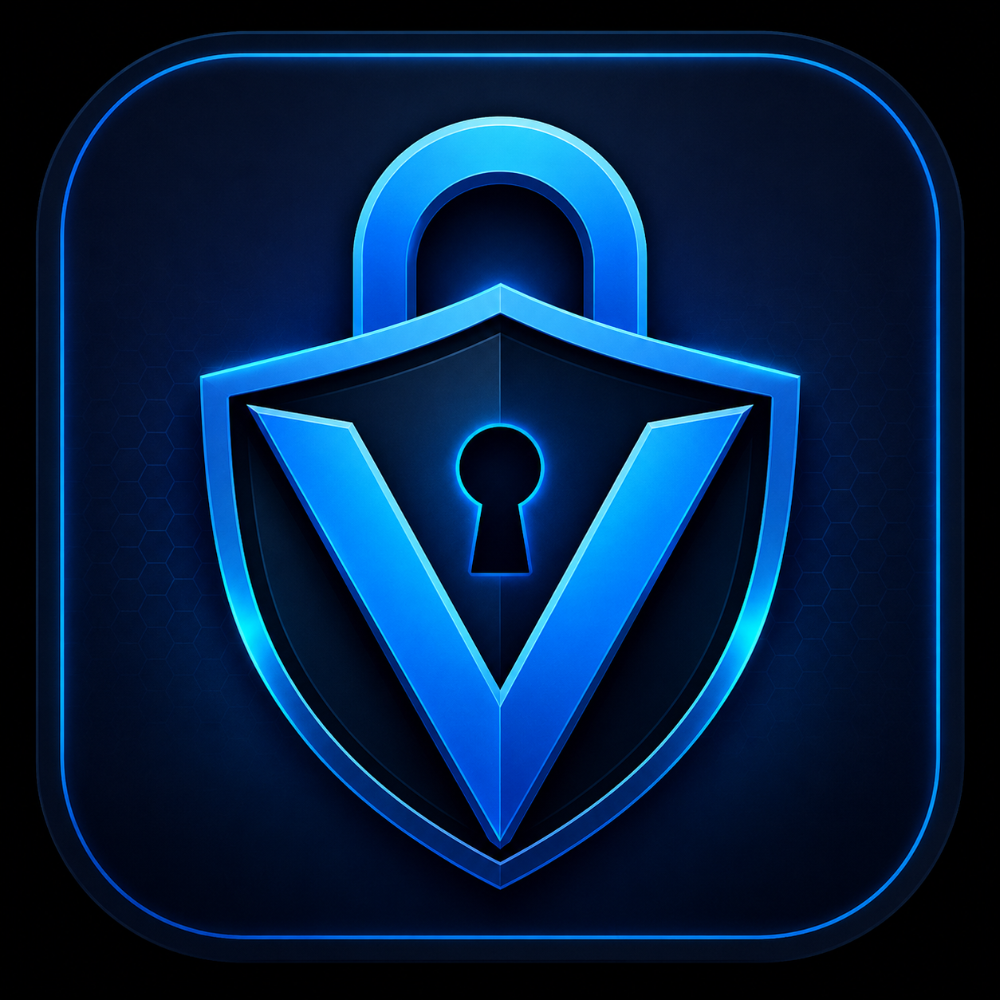
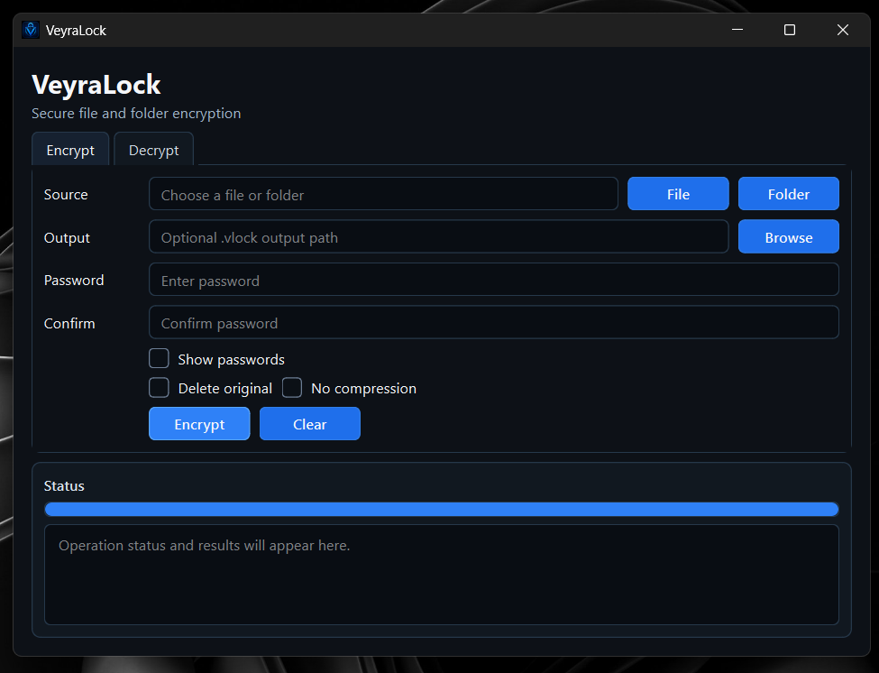
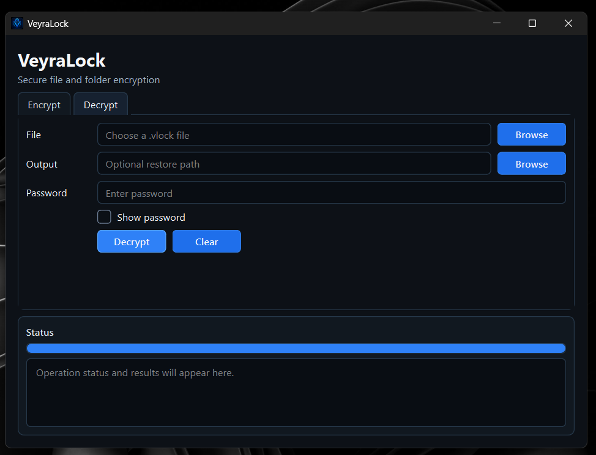

# VeyraLock

<p align="center">
  
</p>

<p align="center">
  <b>Secure file and folder encryption with a clean GUI and CLI workflow.</b>
</p>

<p align="center">
  
  
  
  
  
</p>

---

## Overview

**VeyraLock** is a cross-platform file and folder encryption tool. It uses **AES-256-GCM**, **Argon2id**, encrypted metadata, wrong-password detection, and tamper detection.

> VeyraLock is designed to make unauthorized decryption computationally infeasible when a strong password is used.

VeyraLock does not claim to be “unbreakable” or “100% secure.” Security depends on strong passwords, safe devices, and correct use.

---

## Screenshots

### Encrypt Tab



### Decrypt Tab



---

## Features

- Encrypt and decrypt any file type
- Encrypt and decrypt folders
- AES-256-GCM authenticated encryption
- Argon2id password-based key derivation
- Random salt and nonce for every encryption
- Encrypted original filename metadata
- Wrong-password detection
- Tamper detection
- Clean PySide6 desktop GUI
- Command-line interface
- One Windows EXE release
- Best-effort delete-original option
- Encrypt tab uses password + confirm password
- Decrypt tab uses password only

---

## Download

Download the Windows EXE from the **Releases** page:

```text
VeyraLock.exe
```

Double-click `VeyraLock.exe` to open the GUI.

---

## GUI Usage

### Encrypt

1. Open the **Encrypt** tab.
2. Choose a file or folder.
3. Optional: choose output path.
4. Enter password and confirm password.
5. Click **Encrypt**.

### Decrypt

1. Open the **Decrypt** tab.
2. Choose a `.vlock` file.
3. Optional: choose output path.
4. Enter password.
5. Click **Decrypt**.

---

## CLI Usage

Open GUI:

```powershell
.\VeyraLock.exe --gui
```

Show help:

```powershell
.\VeyraLock.exe --help
```

Encrypt a file:

```powershell
.\VeyraLock.exe encrypt report.pdf
```

Encrypt a folder:

```powershell
.\VeyraLock.exe encrypt project-folder
```

Decrypt a file:

```powershell
.\VeyraLock.exe decrypt report.pdf.vlock
```

Show safe metadata:

```powershell
.\VeyraLock.exe info report.pdf.vlock
```

---

## Installation from Source

```bash
git clone https://github.com/vinodprabhashvara/veyralock.git
cd veyralock
```

Windows:

```powershell
python -m venv .venv
.venv\Scripts\Activate.ps1
pip install -r requirements.txt
pip install -e .
```

Linux/macOS:

```bash
python3 -m venv .venv
source .venv/bin/activate
pip install -r requirements.txt
pip install -e .
```

Run GUI from source:

```bash
python -m veyralock.gui
```

Run CLI from source:

```bash
python -m veyralock.cli --help
```

---

## Building Windows EXE

```powershell
.\scripts\build_windows.ps1
```

Output:

```text
dist\VeyraLock.exe
```

Test:

```powershell
.\dist\VeyraLock.exe --gui
.\dist\VeyraLock.exe --help
```

---

## Security Design

VeyraLock uses established cryptographic primitives instead of custom encryption.

- **AES-256-GCM** protects confidentiality and detects tampering.
- **Argon2id** derives keys from passwords.
- A new random salt is generated for every encryption.
- A new random nonce is generated for every encryption.
- The original filename is stored inside the encrypted payload, not exposed in the public header.

VeyraLock does not use homemade ciphers, XOR encryption, Caesar cipher, or plain SHA256(password) as the encryption key.

---

## What VeyraLock Protects Against

- Offline decryption attempts without the correct password
- Silent tampering with encrypted files
- Accidental filename exposure in public headers
- Unsafe storage, upload, backup, or file transfer locations

---

## What VeyraLock Does Not Protect Against

- Weak passwords
- Malware or keyloggers on your device
- A compromised operating system
- Forgotten passwords
- Guaranteed forensic deletion of originals

If you forget your password, VeyraLock cannot recover your files.

---

## Password Safety

Use a strong unique password.

Recommended:

- At least 12 characters
- Prefer 16+ characters
- Avoid reused passwords
- Avoid common passwords like `password123`, `admin123`, or `qwerty`

---

## Secure Delete Warning

The delete-original option is **best-effort only**. It may not securely erase data on SSDs, cloud folders, journaling filesystems, snapshots, or drives with wear leveling.

---

## Development

Run tests:

```bash
python -m pytest
```

Compile check:

```bash
python -m py_compile veyralock_entry.py veyralock/gui.py veyralock/cli.py veyralock/crypto.py
```

---

## Project Structure

```text
veyralock/
├── .github/
├── assets/
├── docs/screenshots/
├── scripts/
├── tests/
├── veyralock/
├── veyralock_entry.py
├── README.md
├── SECURITY.md
├── CHANGELOG.md
├── RELEASE_NOTES.md
├── LICENSE
├── pyproject.toml
└── requirements.txt
```

---

## Release

[Download VeyraLock v1.0.0](https://github.com/VinodPrabhashvara/veyralock/releases/tag/v1.0.0)

---

## Security Policy

See [SECURITY.md](SECURITY.md).

---

## Changelog

See [CHANGELOG.md](CHANGELOG.md).

---

## License

VeyraLock is released under the MIT License. See [LICENSE](LICENSE).

---

## Disclaimer

VeyraLock is security software, but no software can guarantee absolute protection. Use strong passwords, keep your system secure, and maintain backups.
